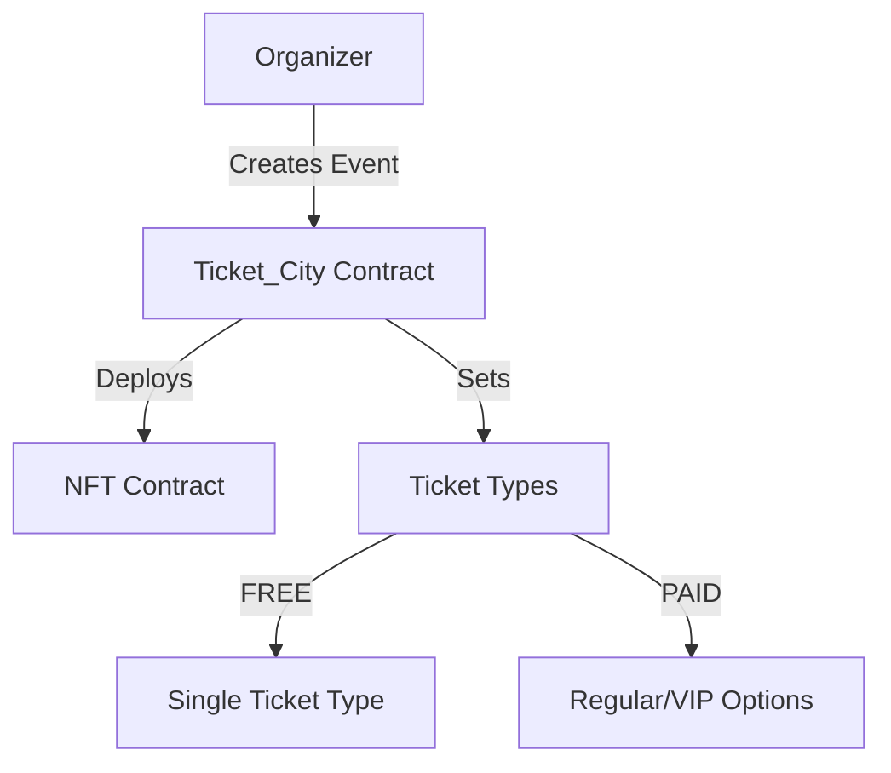
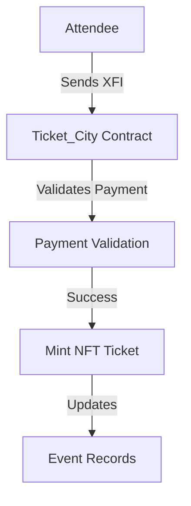

# Ticket City - Technical Documentation

## Smart Contract Architecture

### Core Components

1. `Ticket_City.sol`: Main contract handling event logic and XFI payments
2. `Ticket_NFT.sol`: Non-transferable NFT implementation for event tickets
3. `Types.sol`: Data structures and enums
4. `Errors.sol`: Custom error definitions

### Key Features Implementation

#### Event Management

- Event creation with flexible ticket types (FREE/PAID)
- Ticket categories: Regular and VIP for paid events
- Revenue management through XFI native token
- Attendance tracking and verification system

#### Security Measures

- NonReentrant guard for payment functions
- Event organizer verification
- Minimum attendance rate requirements
- Revenue release conditions

### Smart Contract Interactions

#### Event Creation Flow

#### Ticket Purchase Flow

### Revenue Management

- XFI payments held in contract
- 60% minimum attendance requirement
- Automated revenue release post-event
- Manual release option for owner

### Event Verification System

- Organizer-controlled attendance marking
- Bulk verification support
- Attendance rate calculation
- Revenue release conditions

## Contract Constants

- `FREE_TICKET_PRICE`: 0 XFI
- `MINIMUM_ATTENDANCE_RATE`: 60%

## Error Handling

- Custom errors for gas optimization
- Comprehensive validation checks
- Secure payment processing
