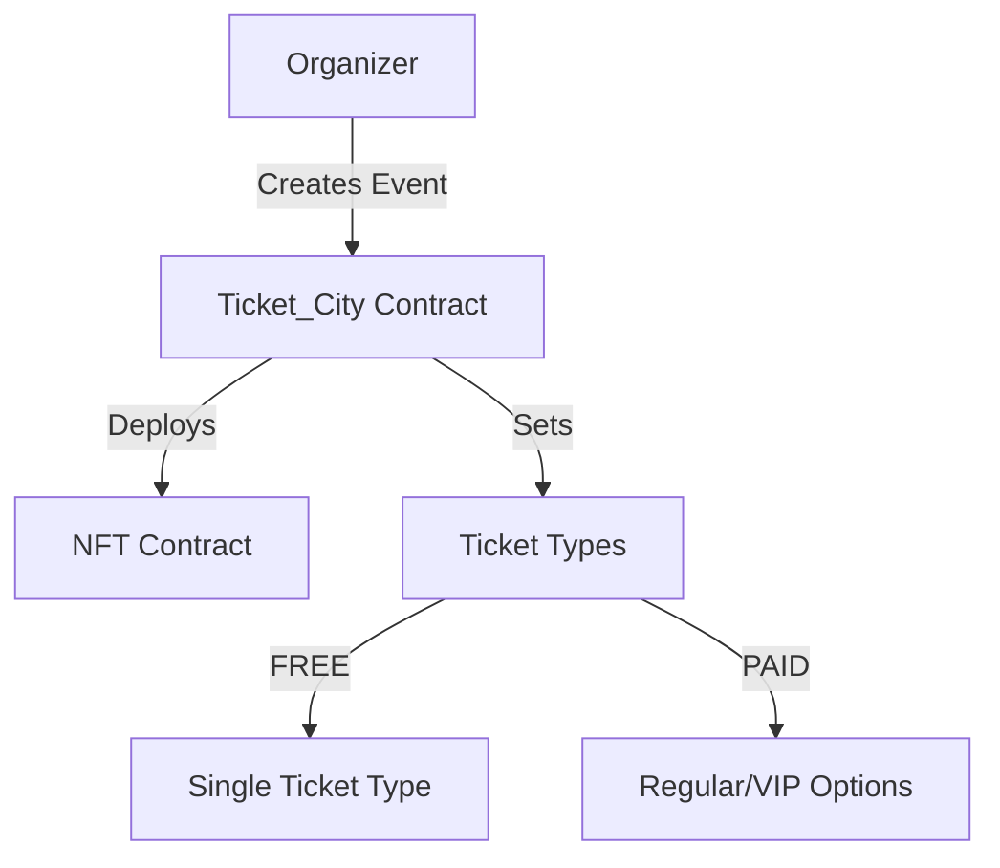
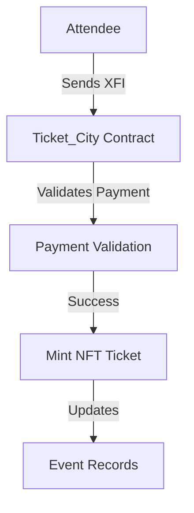

# Ticket City - Technical Documentation

## Smart Contract Architecture

### Core Components

1. `Ticket_City.sol`: Main contract handling event logic and XFI payments
2. `Ticket_NFT.sol`: Non-transferable NFT implementation for event tickets
3. `Types.sol`: Data structures and enums
4. `Errors.sol`: Custom error definitions

### Key Features Implementation

#### Event Management

- Event creation with flexible ticket types (FREE/PAID)
- Ticket categories: Regular and VIP for paid events
- Revenue management through XFI native token
- Attendance tracking and verification system

#### Security Measures

- NonReentrant guard for payment functions
- Event organizer verification
- Minimum attendance rate requirements
- Revenue release conditions

### Smart Contract Interactions

#### Event Creation Flow

#### Ticket Purchase Flow

### Key Features
- Event Management
- Create free or paid events
- VIP and Regular ticket categories
- Tickets issued as NFTs for security
- Automated ticket pricing based on demand(Future Implementation)
- Event discovery tools, including referral programs and discount codes (Future Implementation)

### Payments & Refunds
- Tickets purchased using XFI
- Organizers pay a small platform service fee (30 XFI) for non-free events
- Ticket payments held safely until the event ends
- If an event is canceled, attendees get a refund plus a 2 XFI gas fee compensation from the organiser (Future Implementation)

### Revenue Management

- XFI payments held in contract
- 60% minimum attendance requirement
- Automated revenue release post-event
- Manual release option for owner

### Event Verification System

- Attendance tracked through QR codes or wallet authentication
- attendee-controlled their attendance marking
- Bulk verification support by an attendee that registered for others(Future Implementation)
- Attendance rate calculation
- Revenue release conditions

## Contract Constants

- `FREE_TICKET_PRICE`: 0 XFI
- `MINIMUM_ATTENDANCE_RATE`: 60%

## Error Handling

- Custom errors for gas optimization
- Comprehensive validation checks
- Secure payment processing
